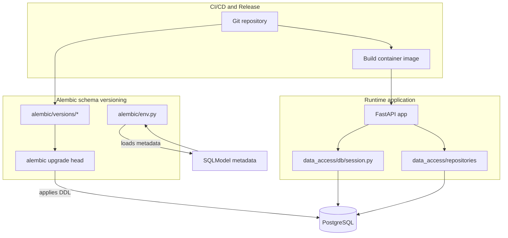
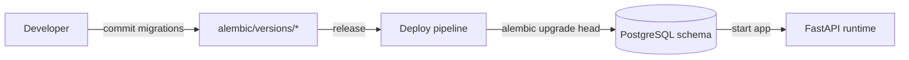
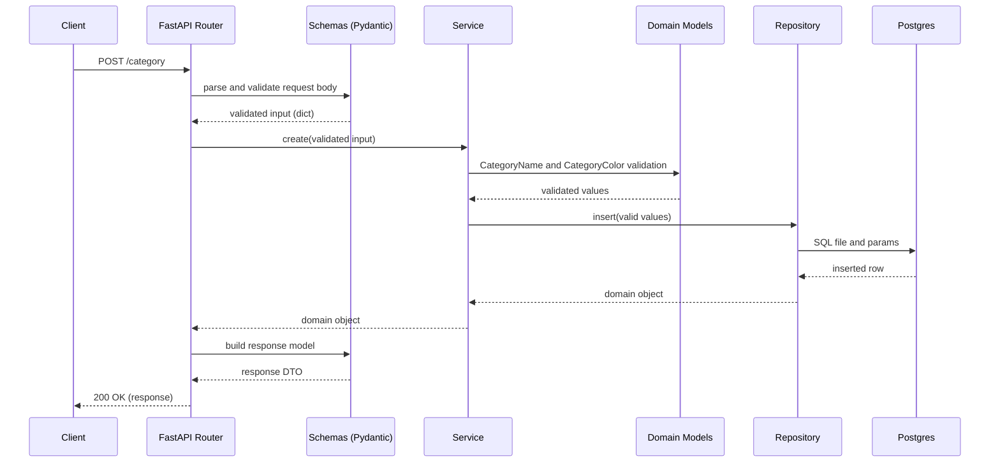

# Architecture

This dummy repo follows a simple layered architecture.

## Layers

## Alembic

## Request flow: Create category

## Key decisions

- **Validate before persistence**: we validate `category` and `color` in `domain/`.
- **SQL files in repo**: queries are stored under `data_access/repositories/sql/`.
- **Mapping**: repository converts DB rows into domain objects via mappers.
